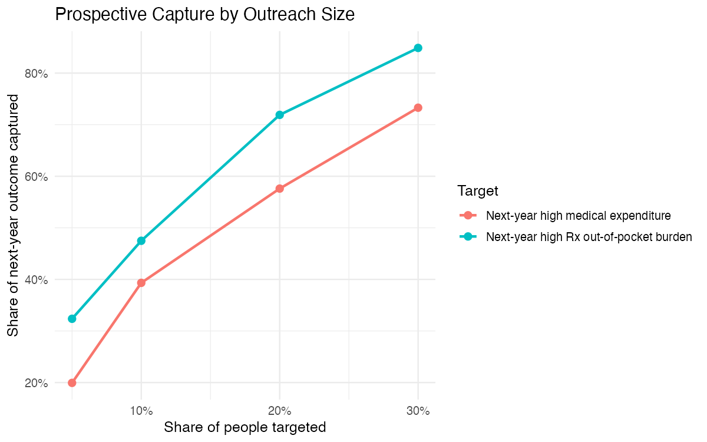

# Prospective Healthcare Cost and Pharmacy-Burden Risk

## Question

Can prior-year survey, utilization, expenditure, insurance, access, chronic
condition, and prescription information identify people at elevated risk of
high medical spending or high prescription out-of-pocket burden in the
following year?

## Data and design

The analysis uses the Medical Expenditure Panel Survey (MEPS), including Panel
24 longitudinal records and Prescribed Medicines event files. Features from
2021 predict outcomes in 2022 for the same people.

The two weighted targets are:

- Next-year medical expenditure at or above the 90th percentile: approximately
  $15,256.
- Next-year prescription self/family payment at or above the 90th percentile:
  approximately $517.

Using prior-year predictors avoids the temporal leakage in a same-year baseline
that used 2022 utilization to classify 2022 expenditure.

## Approach

- Preserve MEPS survey weights in descriptive estimates and model evaluation.
- Compare logistic regression, random forest, and gradient boosting models.
- Evaluate discrimination, calibration, precision, recall, and lift at fixed
  outreach capacity.
- Audit performance by age, income, insurance, race or ethnicity, and chronic
  condition burden.
- Treat thresholds as resource-allocation choices rather than defaulting to
  0.50.

## Findings

| Target | Best model | ROC-AUC | PR-AUC | Precision | Recall |
| --- | --- | ---: | ---: | ---: | ---: |
| Next-year high medical expenditure | Random forest | 0.835 | 0.611 | 0.464 | 0.667 |
| Next-year high prescription burden | Random forest | 0.883 | 0.616 | 0.490 | 0.740 |

At constrained outreach levels, ranking adds practical value:

| Target | Outreach share | Capture rate | Precision |
| --- | ---: | ---: | ---: |
| High medical expenditure | 10% | 39.3% | 74.6% |
| High medical expenditure | 20% | 57.6% | 55.2% |
| High prescription burden | 10% | 47.5% | 66.4% |
| High prescription burden | 20% | 71.9% | 52.2% |

## Subgroup reliability

Performance is not uniform across groups. Calibration and recall vary by age,
income, insurance, race or ethnicity, and chronic-condition burden. Several
subgroups are small enough that AUC or threshold metrics are unstable or
undefined. Group-specific thresholds can change recall, but they are presented
as a sensitivity analysis—not as an approved fairness policy.

## Decision

The prospective scores can support prioritization for care-management,
affordability, or pharmacy-navigation outreach when capacity is limited. They
should not be used for coverage denial, pricing, restricting care, or clinical
decision-making.

## Limitations

- MEPS is nationally representative survey data, not a production claims feed.
- The longitudinal cohort is smaller than the cross-sectional full-year sample.
- Prescription features summarize events and therapeutic classes; they do not
  model individual drug identities.
- Fixed-threshold performance may shift across populations and years.
- Small subgroup estimates require cautious interpretation.
- Observed predictive performance does not establish that outreach will improve
  health or financial outcomes.

The [model card](docs/model_card.md) documents intended use, temporal design,
fairness checks, thresholds, and data sources. The
[variable dictionary](docs/variable_dictionary.md) defines the analytical
fields.

## Data source

[MEPS public-use files](https://meps.ahrq.gov/mepsweb/data_stats/download_data_files.jsp)
are published by the Agency for Healthcare Research and Quality. Source data is
not included in this repository.
